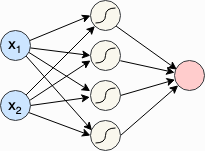

# XOR Model

### Optimizer

- Get a batch from the data loader
- Obtain the predictions from the model for the batch
- Calculate the loss based on the difference between predictions and labels
- Backpropagation: calculate the gradients for every parameter with respect to the loss
- Update the parameters of the model in the direction of the gradients

### Loss Function

- Binary Cross Entropy